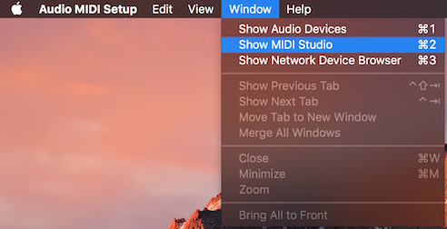
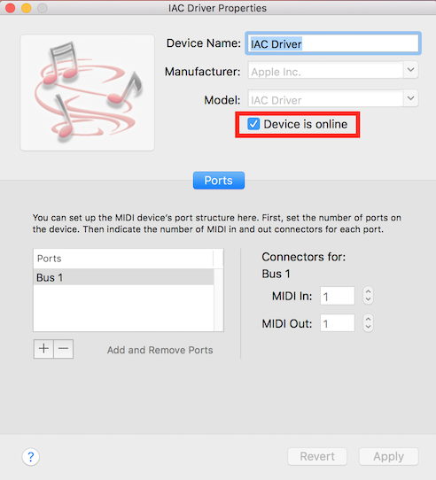
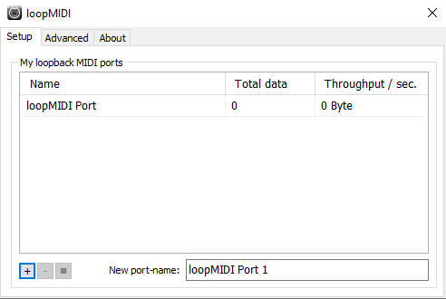

# Mac

## On Mac, you can use the IAC bus to create any number of virtual MIDI buses. This driver can be activated in the Audio MIDI Setup Utility.

  1. Launch Audio MIDI Setup and select Show MIDI Studio from the menu.
  
  2. Now double-click the IAC Driver icon and check the option Device is online in order to activate it.
  

# Windows

## Windows does not come with a native virtual MIDI driver, but there are a number of options available for free:

* [RTP loopMIDI](http://www.tobias-erichsen.de/software/loopmidi.html) developed by Tobias Erichsen:
  1. Install loopMIDI
  2. Open loopMIDI and click the plus on the bottom left to add a MIDI port:
  
  3. Use the name of the port in Supercollider like so:
    ```
    //MIDI
    MIDIClient.init;
    //Note: you need to put the correct name here, IAC (etc.) is for a Mac
    ~midiOut = MIDIOut.newByName("loopMIDI Port", "loopMIDI Port");
    ~dirt.soundLibrary.addMIDI(\midi, ~midiOut);
    ~midiOut.latency = 0.0;
    ```

* There is also MIDI Yoke as an option. As a part of the [MIDI OX Utility](http://www.midiox.com/), is probably the best-known Windows equivalent to Mac's IAC Bus. Note: It's 32-bit only.
